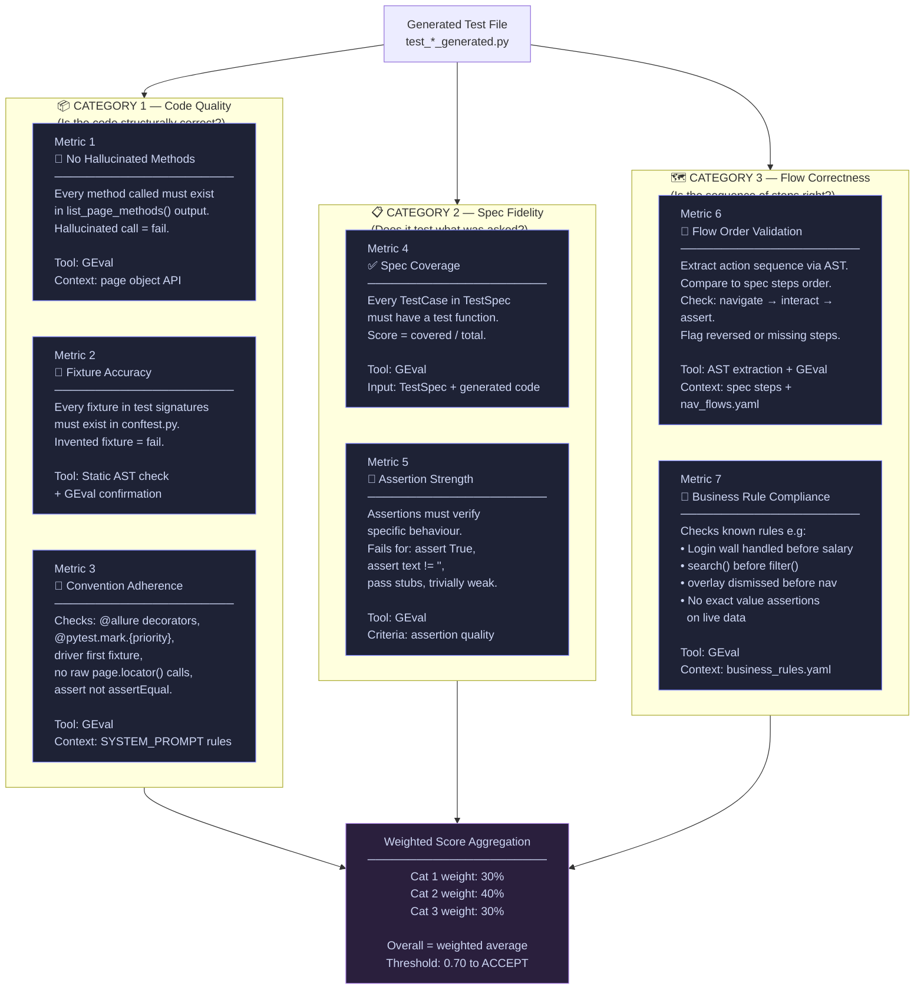
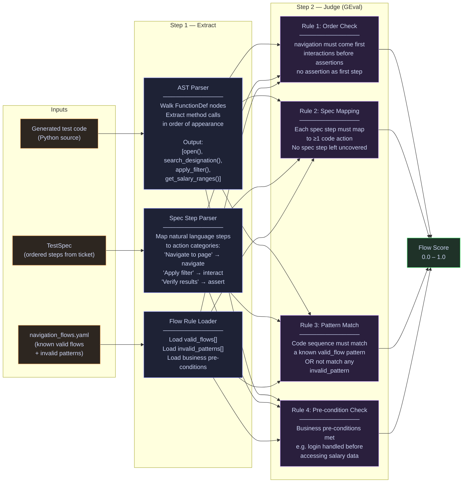
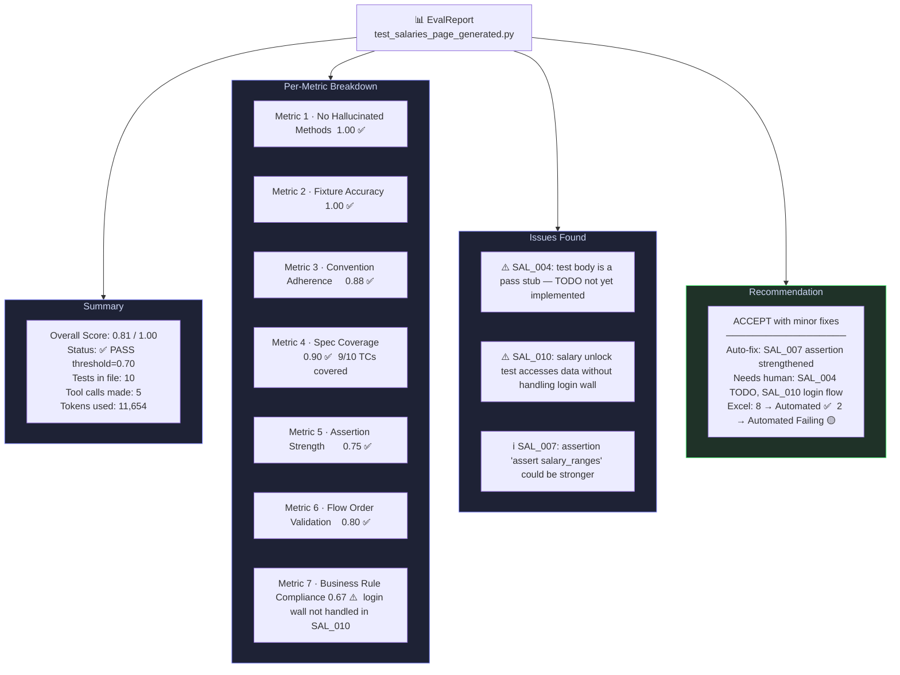

# Stage 4 — Eval Agent: High-Level Design

## 1. Full Pipeline with Eval Gate

```mermaid
flowchart TD
    INPUT["📥 Input\nJira / ADO / Excel / Free-text"]

    S1["⚙️ STAGE 1 — PARSE\nparser_agent.py\n──────────────\nTestSpec\n(TC IDs · steps · expected results)"]

    S2["🔍 STAGE 2 — RAG RETRIEVE\nretriever.py\n──────────────\nRetrievalResult\n(code + tests + knowledge)"]

    CTX_CHECK{"🔎 Context Coverage\nChecker\n──────────────\nHow much does the\nRAG know about\nthis feature?"}

    HIGH["✅ HIGH\nFull page object\n+ similar tests\n+ business rules\nexist in RAG"]

    MED["⚠️ MEDIUM\nPage object exists\nbut some methods\nmissing OR no\nsimilar tests found"]

    LOW["❌ LOW / ZERO\nNo page object,\nno tests, no\nbusiness rules\nin RAG at all"]

    S3["✨ STAGE 3 — GENERATE\ngenerator_agent.py\n──────────────\nGPT-4o agentic loop\n(tool calls: list_page_methods,\nget_fixtures, read_file,\nsearch_context)"]

    SCAFFOLD["📝 Generate with\nDetailed TODO Scaffold\n──────────────\nPartial code +\nprecise TODOs:\n'Add method X to PageY\nat path Z'"]

    DISCOVERY["🧭 DISCOVERY MODE\ndiscovery_agent.py\n──────────────\nReport missing context\n+ structured questionnaire\nOR live site crawl\n→ auto-build page object\n→ update YAML knowledge\n→ re-index RAG\n→ then generate"]

    S4["🧪 STAGE 4 — EVAL\neval_agent.py\n──────────────\nRun 7 metrics\nacross 3 categories"]

    REPORT["📊 EvalReport\n──────────────\nOverall score\nPer-metric scores\nIssues found\nRecommendation"]

    EXCEL["📊 Excel Update\n──────────────\nPASS → Automated ✅\nFAIL → Automated (Failing) 🟡\nDISCOVERY → Needs Context 🔴"]

    DECISION{"Overall Score\n≥ threshold\n(0.70)?"}

    ACCEPT["✅ ACCEPT\nWrite final test file\nUpdate Excel → Automated"]

    REGEN["🔄 REGENERATE\nFeed EvalReport\nback to Stage 3\nas additional context\n(max 2 attempts)"]

    HUMAN["🙋 ESCALATE TO HUMAN\nScore too low after\n2 regen attempts\nFlag for manual review"]

    INPUT --> S1 --> S2 --> CTX_CHECK
    CTX_CHECK -->|High| HIGH --> S3
    CTX_CHECK -->|Medium| MED --> SCAFFOLD
    CTX_CHECK -->|Low/Zero| LOW --> DISCOVERY
    SCAFFOLD --> S3
    DISCOVERY --> S3
    S3 --> S4 --> REPORT --> DECISION
    DECISION -->|Yes| ACCEPT --> EXCEL
    DECISION -->|No| REGEN
    REGEN -->|Attempt 1 or 2| S3
    REGEN -->|Still failing| HUMAN --> EXCEL
    ACCEPT --> EXCEL

    classDef stage    fill:#1e2235,stroke:#7c83fd,color:#cdd6f4
    classDef decision fill:#1f2d3d,stroke:#8be9fd,color:#cdd6f4
    classDef good     fill:#1f3228,stroke:#50fa7b,color:#cdd6f4
    classDef warn     fill:#2d2a1f,stroke:#ffb86c,color:#cdd6f4
    classDef fail     fill:#3d1f1f,stroke:#ff5555,color:#cdd6f4
    classDef output   fill:#2a1f3d,stroke:#bd93f9,color:#cdd6f4

    class S1,S2,S3,S4 stage
    class CTX_CHECK,DECISION decision
    class HIGH,ACCEPT good
    class MED,SCAFFOLD,REGEN warn
    class LOW,DISCOVERY,HUMAN fail
    class REPORT,EXCEL output
```



---

## 2. Stage 4 Eval — 7 Metrics Across 3 Categories



---

## 3. Discovery Mode — Zero Context Flow

```mermaid
flowchart TD
    UNKNOWN["Agent receives request for\nan unknown page / feature\ne.g. Community → My Company"]

    INTROSPECT["🔎 Context Coverage Check\n──────────────────────\nSearch RAG for page name\nSearch RAG for feature keywords\nCheck pages/ folder for page object\nCheck knowledge/ YAML files"]

    MISSING["📋 Discovery Report\n──────────────────────\n□ No page object found\n□ No navigation flow found\n□ No business rules found\n□ No similar tests found"]

    CHOICE{"Discovery\nStrategy?"}

    QUESTIONNAIRE["📝 Questionnaire Mode\n──────────────────────\nAgent outputs structured Q&A:\n\nNAVIGATION:\n  Q1. URL path?\n  Q2. Entry point from homepage?\n\nINTERACTIONS:\n  Q3. What filters/tabs exist?\n  Q4. Login required?\n\nBUSINESS RULES:\n  Q5. What = success for this page?\n  Q6. Known flaky elements?"]

    CRAWL["🌐 Auto-Crawl Mode\n(discovery_agent.py)\n──────────────────────\n1. Playwright navigates to URL\n2. Extract all interactive elements\n   (buttons, links, inputs, tabs)\n3. Record URL changes on click\n4. Extract visible text labels\n5. Feed DOM snapshot to GPT-4o"]

    USER_ANSWERS["👤 User provides answers\nto questionnaire"]

    GPT_INFER["🤖 GPT-4o infers structure\nfrom DOM snapshot\n──────────────────────\n'This looks like a feed page\nwith category tabs and\na post card component'"]

    BUILD_CONTEXT["🏗️ Build New Context\n──────────────────────\nGenerate page object skeleton:\n  pages/ambitionbox/community_page.py\n\nUpdate YAML knowledge:\n  navigation_flows.yaml → community_page\n  business_rules.yaml → community rules\n  (marked: INFERRED — needs human verify)\n\nRe-index RAG:\n  python -m ai_agent.cli --index"]

    CONFIDENCE{"Confidence in\ninferred context?\n(GPT-4o self-scores)"}

    GENERATE["✨ Proceed to Stage 3\nGenerate tests with\nnewly built context"]

    HUMAN_REVIEW["🙋 Flag for Human Review\n──────────────────────\nOutput discovery report\n+ inferred page object\n+ questions needing answers\nbefore generation is safe"]

    UNKNOWN --> INTROSPECT --> MISSING --> CHOICE
    CHOICE -->|User available| QUESTIONNAIRE
    CHOICE -->|Auto mode| CRAWL
    QUESTIONNAIRE --> USER_ANSWERS --> BUILD_CONTEXT
    CRAWL --> GPT_INFER --> BUILD_CONTEXT
    BUILD_CONTEXT --> CONFIDENCE
    CONFIDENCE -->|High ≥ 0.75| GENERATE
    CONFIDENCE -->|Low < 0.75| HUMAN_REVIEW

    classDef action  fill:#1e2235,stroke:#7c83fd,color:#cdd6f4
    classDef decision fill:#1f2d3d,stroke:#8be9fd,color:#cdd6f4
    classDef good    fill:#1f3228,stroke:#50fa7b,color:#cdd6f4
    classDef warn    fill:#2d2a1f,stroke:#ffb86c,color:#cdd6f4
    classDef fail    fill:#3d1f1f,stroke:#ff5555,color:#cdd6f4

    class INTROSPECT,MISSING,QUESTIONNAIRE,CRAWL,USER_ANSWERS,GPT_INFER,BUILD_CONTEXT action
    class CHOICE,CONFIDENCE decision
    class GENERATE good
    class HUMAN_REVIEW fail
    class UNKNOWN warn
```



---

## 4. Flow Validation — Metric 6 Deep Dive



---

## 5. EvalReport — Output Format



---

## 6. Files to Build

```
ai_agent/
├── stage4_eval/
│   ├── __init__.py
│   ├── models.py              # EvalReport, MetricResult, FailureCategory dataclasses
│   ├── metrics.py             # 7 GEval metric definitions (DeepEval)
│   ├── flow_extractor.py      # AST-based action sequence extractor (Metric 6)
│   ├── eval_agent.py          # Orchestrator — runs all 7 metrics → EvalReport
│   └── context_checker.py     # Pre-generation: High / Medium / Low coverage check
│
├── stage5_discovery/          # (future)
│   ├── __init__.py
│   ├── discovery_agent.py     # Crawl unknown page → infer page object structure
│   └── knowledge_builder.py   # Auto-update navigation_flows.yaml + business_rules.yaml
│
└── cli.py                     # +--eval flag  +--eval after --generate
```

---

## 7. Metric Weights & Scoring

| Category | Metric | Weight | Fail if |
|---|---|---|---|
| Code Quality | No Hallucinated Methods | 15% | Any invented method |
| Code Quality | Fixture Accuracy | 10% | Any invented fixture |
| Code Quality | Convention Adherence | 5% | < 3 conventions missed |
| Spec Fidelity | Spec Coverage | 25% | < 80% test cases covered |
| Spec Fidelity | Assertion Strength | 15% | > 2 trivially weak assertions |
| Flow Correctness | Flow Order Validation | 15% | navigate/interact/assert out of order |
| Flow Correctness | Business Rule Compliance | 15% | Any known rule violated |

**Overall threshold to ACCEPT: 0.70**  
**Auto-regenerate if: 0.50 – 0.69** (max 2 attempts)  
**Escalate to human if: < 0.50**
